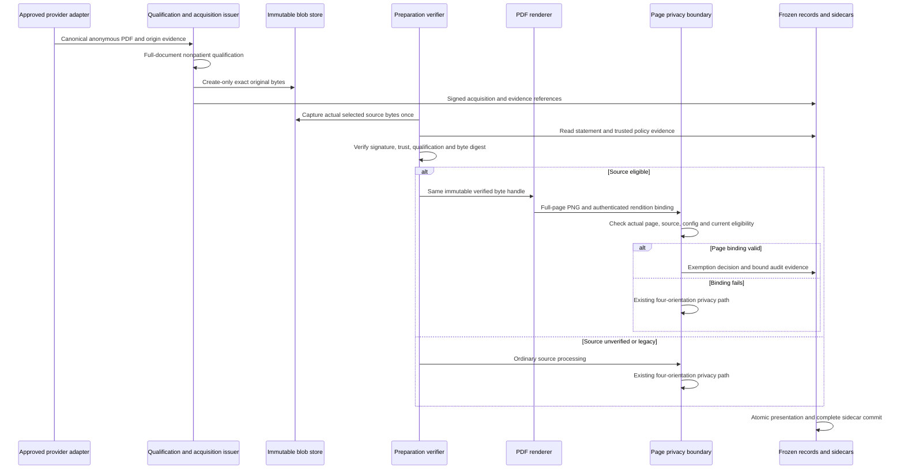

# M95: verified public-source provenance

Status: proposed design, 2026-09-30. This document authorizes no implementation,
migration, production reingestion, OCR, rendering, package generation, test run or
benchmark. Only this document is being created. It contains no production input
identifiers, filenames, paths, contents or digest values.

## 1. Decision and limits of the claim

Implement A first: an authenticated public-acquisition and content-qualification
route that can exempt qualified literature page renditions from repeated privacy
OCR during first preparation. D, frozen prepared-output reuse, follows for later
exports. B, reusable signed privacy-processing attestations, is separate future
work. C, geometry optimization, remains last. An A acquisition statement is not a
B assertion that OCR/redaction ran successfully.

Eligibility belongs to exact bytes plus authenticated qualification evidence and
the currently accepted policy. Artifact IDs, MedicalLiterature membership, title,
citation, DOI, source URI, user-supplied hash, and frozen snapshot hash grant no
eligibility. Legacy sources remain automatically ineligible. Veteran-specific,
uncertain and otherwise unverified material retains the existing four-orientation
privacy path.

The signed claim is: **an authorized EMF issuer acquired these exact PDF bytes
through this approved public-origin route and qualified this entire document as
an unpersonalized, unannotated, nonpatient publication under policy X**. The
signature authenticates EMF's assertion and its evidence bindings. It is not a
mathematical proof that public PDFs contain no patient information. TLS and a
hash establish neither semantic cleanliness nor absence of flattened markup.
Public case reports, user submissions, patient narratives and uncertain content
do not qualify under the initial policy even if publicly accessible.

Initial scope is one explicitly qualified provider adapter, anonymous canonical
article PDFs in an approved nonpatient publication class, full-document review,
and complete source-page renditions. Provider, content-class and review-rubric
approval must precede activation. A hostname allowlist alone is insufficient.

## 2. Current EMF findings and integration boundaries

Read-only inspection of current source established:

- `src/EMF.Extensions.VeteransClaims/Models/Adjudication/MedicalLiteratureSource.cs`
  permits optional SourceUri and SourceHash. These are descriptive metadata.
- `src/EMF.Extensions.VeteransClaims/Services/MedicalLiteratureService.cs`,
  AddSourceArtifactAsync, associates arbitrary artifact IDs without byte comparison.
- `src/EMF.Persistence/Storage/FileSystemArtifactContentStore.cs` replaces existing
  pointer contents through File.Move with overwrite enabled.
- `src/EMF.Extensions.VeteransClaims.Orchestration/VeteransReviewerPackageDetailsService.cs`
  resolves text and printable pages using artifact IDs before source freezing.
- `VeteransReviewerPackagePresentationPreparation.Prepare` restores v1 and invokes
  the DOCX renderer. Its page-privacy calls reach `VeteransReviewerPagePrivacy.Mask`.
  Qualification and rendition binding must exist before this first privacy check.
- `VeteransReviewerSnapshotV1Contract` and existing snapshot/presentation identity
  semantics must remain unchanged. New proof belongs in append-only sidecars and a
  separately validated preparation context.

The current `VeteransClaimsSqliteMigrations.cs` catalog ends at migration **94**,
FreezeReviewerPackagePresentation. The proposed next migration is **95**,
AddVerifiedPublicSourceProvenance, provided 95 remains unallocated when implemented.
M95 is a milestone label; its agreement with SQL migration 95 is established by
this inspection, not assumed from the label. Recheck before implementation. No
database has been opened or migrated for this design.

Current migration 92 uses WITHOUT ROWID, guards both its primary-key and composite
unique replacement conflicts, and explicitly checks parent existence. Migration
93 archives immutable manifests WITHOUT ROWID. Migration 94 adds immutable
presentation/PDF records, duplicate JSON-key rejection, exact source/header
binding, and parent/lineage guards independent of foreign_keys. These current
definitions supersede weaknesses described in earlier review reports. Reuse their
hardening patterns; do not alter migrations 92–94 or fabricate historical rows.

Applicable ancestor, repository-root and docs-directory AGENTS.md files were
checked; none were present at those locations.

## 3. Architecture, ownership and threats

Separate responsibilities:

| Boundary | Responsibility and authority |
| --- | --- |
| Provider adapter | Resolve approved public article identity, retrieve canonical PDF anonymously, retain bounded origin observations |
| Qualification service | Inspect complete PDF and enforce approved nonpatient class, personalization and annotation review requirements |
| Acquisition issuer | Independently enforce acquisition and review prerequisites; sign only qualified byte identities |
| Immutable blob store | Store create-only exact PDF bytes; never supply trust merely from a filename or lookup key |
| Preparation verifier | Check signatures, policy, current trust status, exact consumed bytes and rendition chain; hold no issuance private key |
| Trusted PDF renderer | Consume the verified byte handle, emit fully bound page renditions |
| Persistence repositories | Validate signed envelopes and relational bindings on both writes and reads; commit sidecars atomically |
| Administrative trust owner | Approve providers/policies/keys; publish signed trust and revocation bundles separately from ordinary content writes |

Proposed domain contracts remain Azure-free. Put acquisition/qualification models
and repository contracts in appropriate core/domain projects, orchestration in
the orchestration layer, persistence in its SQLite adapter, and Azure signing in
EMF.Security.Azure through a neutral security contract. Follow existing dependency
directions; do not introduce an Azure dependency into VeteransClaims or its SQLite
domain-facing contracts.

Threats covered include malicious local uploads, stale or dishonest metadata,
artifact replacement, TOCTOU, modified PDFs, forged qualifications, key substitution,
unapproved redirects, source confusion, mismatched page caches, policy replay,
partial database/file commits, broken audit links and direct SQL changes with
foreign_keys or recursive_triggers disabled. Qualification reviewers are authorized
to provide evidence, not to bypass acquisition or possess the issuance key.

A compromised issuer, malicious approved publisher, defective review rubric or
compromised execution environment can make false signed assertions. Independent
provider qualification, access separation, revocation and review reduce these
risks; cryptography does not eliminate them. SQLite administrators able to remove
triggers and replace trusted application code exceed database structural protection.
Signatures and a trust root outside the database still detect forged evidence,
but cannot stop a fully compromised process from deliberately bypassing verification.

## 4. Acquisition and full-document qualification

1. Resolve a DOI or repository article identifier using an approved adapter.
   Confirm publisher/repository, article version and canonical PDF relationship.
   Identifiers are locators, never authentication by themselves.
2. Fetch with an isolated anonymous client carrying no veteran/package inputs,
   account cookies, institutional credentials or personalized download parameters.
   Validate TLS, every redirect and approved CDN destination. Reject private-network
   destinations, unexpected schemes, ambiguous article/version relationships,
   unsupported media, oversized responses and secret-bearing provenance URLs.
   Enforce SSRF controls through redirects, DNS resolution and connection targets.
3. Capture exact PDF payload bytes after HTTP transfer/content decoding and before
   any PDF rewrite, normalization, metadata removal or repair. Compute SHA-256 and
   byte length from the same bounded buffer written to immutable storage.
4. Inspect structure and review every page, figure, margin, attachment possibility
   and appended page. Reject encryption, embedded files, active content, forms,
   unsupported structures and user markup. Permit publisher link annotations only
   through an explicit subtype rule. Missing `/Annots` does not prove no flattened
   markup, personalization or patient material exists.
5. Require affirmative evidence for approved nonpatient publication class,
   canonical article identity, anonymous/unpersonalized acquisition and absence of
   added annotation under the rubric. A classifier may assist but cannot silently
   replace required authorized review. Uncertain results are not eligible.
6. Issue only after all evidence is bound to the exact PDF digest and the complete
   document. A signature from the trusted EMF acquisition service attests that it
   observed retrieval. Ordinary HTTPS does not provide a publisher signature over
   PDF bytes. Where available, independently verify a publisher-signed manifest
   and retain its digest/signature as additional evidence.

Local uploads never become eligible automatically, even after review or a metadata
edit. Review cannot manufacture authenticated origin. Production adoption requires
fresh acquisition and qualification through this route, with a new source revision
and explicit association. Do not retrospectively bless old content by looking up
its hash in a new acquisition table. An identical fresh canonical PDF can be used
as the new acquired object; old package identities and classifications remain
unchanged.

## 5. Signed acquisition envelope and canonicalization

Proposed profile: `emf-public-acquisition-v1`, SHA-256 content identity, PS256
(RSA-PSS with SHA-256, MGF1-SHA-256 and 32-byte salt), a dedicated RSA signing key
of at least 3072 bits, and RFC 8785 JSON canonicalization with a restricted schema.
This is an implementation proposal, not a claim that signing already exists.
Confirm approved cryptographic policy and provider support before activation.

Canonical payload fields are mandatory unless explicitly marked optional below:

| Group | Exact fields |
| --- | --- |
| Envelope identity | schemaVersion, statementType, statementId, acquisitionRequestId, issuerId, issuedUtc, expiresUtc |
| Subject | subject.digestAlgorithm, subject.digest, subject.byteLength, subject.mediaType, subject.pageCount, subject.scope=`full-document` |
| Article | article.providerId, article.repositoryOrPublisherId, article.canonicalId, article.versionId, article.canonicalLandingUri, article.canonicalPdfUri; optional doi and pmid |
| Retrieval | acquisition.retrievedUtc, adapterId, adapterVersion, adapterConfigDigest, routePolicyDigest, accessProfile=`anonymous-public`, evidenceDigest, transportValidationProfile, redirectChainDigest |
| Qualification | qualification.contentClass, rubricId, rubricVersion, rubricDigest, inspectedPdfDigest, structuralInspectorId, structuralInspectorVersion, structuralReportDigest, reviewedPageCount, reviewEvidenceDigest, reviewerAuthorityId, reviewedUtc, evaluatorProfileDigest |
| Explicit assertions | qualification.canonicalArticleConfirmed, anonymousUnpersonalizedAcquisitionConfirmed, noAddedAnnotationConfirmed, approvedNonpatientClassConfirmed, fullDocumentReviewed; all must be true |
| Policy decision | decision.value=`qualified-public-source`, decision.exemptionScope=`source-page-privacy-ocr`, policyId, policyVersion, policyDigest |
| Signing identity | signatureProfile, signingKeyId with exact key version, trustDomain |

The envelope contains the canonical payload bytes and base64url signature.
statementId and acquisitionRequestId are opaque random IDs, not artifact IDs or
content-derived identifiers. Optional fields are omitted, not ambiguously null.
Use integer values only within an explicitly bounded exact range; no floats.
Use fixed UTC timestamp representation with explicitly validated precision and
calendar semantics. Use uppercase hexadecimal digest encoding consistently with
current SQLite digest conventions. Reject invalid Unicode, duplicate keys at any
depth, unknown fields, unrecognized enum values, noncanonical encodings and
out-of-range values. Do not silently normalize signed strings or URLs during
verification. URL validation and canonical resolution precede issuance.

Sign the digest of the ASCII purpose prefix `EMF-PUBLIC-ACQUISITION-V1`, a zero
separator byte, and canonical UTF-8 payload. The signature profile and key ID are
inside the signed payload. The verifier selects the allowed profile from its own
configuration and rejects algorithm substitution; it does not negotiate arbitrary
algorithms from untrusted input. Define separate purpose prefixes for rendition
and preparation evidence. Define each statement digest over the complete bounded
canonical envelope, including signature; never use an unsigned header as its ID.
Store canonical bytes exactly and revalidate them on every authoritative read.
Use a digest-signing provider operation with the single precomputed 32-byte SHA-256
digest; do not pass that digest to a data-signing operation that hashes it again.
Verification uses the matching digest-verification operation and exact PSS
parameters. Encode the full fixed-width RSA signature as unpadded base64url; reject
noncanonical encodings or unexpected signature length. Interoperability fixtures
must detect data-versus-digest API confusion and accidental double hashing.

The schema requires evidence digests so altered review reports cannot be silently
substituted. Evidence availability and digest validity are issuance prerequisites.
Offline consumers may verify a signed qualification without all review detail only
when the policy explicitly permits reliance on the issuer; audit review must be
able to retrieve retained evidence. Do not claim that a digest proves a missing
report was satisfactory.

## 6. Existing Azure infrastructure and key lifecycle

`EMF.Security.Azure/Clients/AzureKeyVaultClientFactory.cs` and
`Cryptography/AzureKeyCryptographyFactory.cs` construct Azure clients using a
system-assigned ManagedIdentityCredential. Existing IAzureKeyCryptography and
IAzureCryptographyClient expose only WrapKeyAsync/UnwrapKeyAsync, implemented using
RSA-OAEP-256 for envelope encryption. There is no signing contract in those
interfaces. Reuse credential/client-composition, options-validation and test-double
patterns, adding a separate signing-purpose adapter and domain-neutral verifier.
Do not repurpose encryption wrapping keys or change their operation semantics.

ConfiguredAzureKeyReferenceProvider validates syntax of name/version references;
this does not authorize a signer. Verification must use a separately provisioned,
signed, allowlisted trust bundle containing issuer, exact versioned public key,
algorithm, purposes, approved adapters/providers, policy families, valid-from/to,
revocation state and bundle sequence/expiry. Never fetch or trust an arbitrary
parseable key reference or public key supplied by an attestation.

The issuance managed identity has only required signing access to the dedicated
key; preparation identities have no signing permission. Keep private key material
nonexportable in the selected Vault/HSM tier. Security administration owns trust
roots and key/policy approval. Ordinary database writers cannot add trusted keys.
Use a different dedicated purpose/key for preparation/rendition evidence; do not
give the preparation process public-acquisition issuance authority.

Rotation issues new statements with the new exact key version; retain older
public keys for historical verification. Compromise revocation can invalidate
earlier statements even if their embedded issuedUtc predates discovery: a
compromised signer can backdate. Any exception needs an independently trusted
timestamp/checkpoint, not issuer time alone. Track origin/adapter withdrawal and
policy retirement independently from key revocation. Persist the highest accepted
trust-bundle sequence in protected state to resist rollback.
Retirement is distinct from revocation: stop signing with a retired key while
retaining its explicitly trusted public material for historical verification.
Compromise/revocation denies eligibility according to explicit revocation policy
or requires explicitly approved remediation. A valid Azure key of an arbitrary
name, version or owner is never sufficient. Each signing purpose has its own key
identifiers, permissions, ownership and lifecycle independent of encryption keys.

Vault unavailable: do not issue a new acquisition or persistent signed rendition/
preparation exemption record. Previously signed evidence may verify offline using
an authentic sufficiently fresh cached trust bundle; no live Vault call is needed
for public-key signature verification. If trust status is too old or unknown, use
normal privacy processing. Expiry/freshness maximum and offline clock assumptions
are activation decisions. Audit-storage failure cannot silently authorize exemption.

Website changes do not alter the historic bytes or signature. New website bytes
need fresh acquisition. Distinguish signature-valid, historically qualified and
currently eligible. Historical frozen outputs remain immutable; release may be
blocked by separate current-policy status without rewriting them or silently
assigning a new provenance record.

## 7. Exact PDF-to-rendition binding and TOCTOU

The verifier reads the actual selected source into a privately owned immutable
buffer/blob handle, hashes it, checks the statement and current policy, and passes
that exact handle to extraction and rendering. No reopen by mutable ArtifactId
after checking. A read-only memory view backed by caller-mutable storage is
insufficient: ownership and lifetime must prevent mutation. APIs that accept only
ArtifactId require a byte-bound overload or trusted immutable-content adapter.

The verified-source capability is internal, nonserializable and constructible only
by the verifier. It binds source digest/length, acquisition statement digest,
policy/trust revision, validity deadline and the captured handle. A bool in a
snapshot or arbitrary public constructor must not reproduce this authority.

Rendition evidence must bind all of:

- Acquisition statement digest and source PDF digest/length/page count.
- Original one-based PDF page index, exact page box and complete page extent.
- PDF renderer identity, actual verified build identity, managed/native dependency
  profile and rendering configuration digest. A version label alone is insufficient.
- DPI, page dimensions, crop/media box, PDF intrinsic rotation, explicit render
  rotation, annotation policy, color space, background and relevant font profile.
- PNG byte digest/length, decoded width/height, media type, pixel-format profile,
  and orientation at the privacy boundary.
- Geometry digest, coordinate units, dimensions and provenance if geometry is
  supplied; no unbound geometry or caller-added text inherits public-source trust.
- Manifest schema/profile, creation time, approved renderer authority and signature.

Initial scope renders full pages from the verified original. Selection records
original page indexes, not renumbered guesses. At the privacy boundary check actual
PNG bytes and all context against the rendition manifest. A signature on the PDF
does not authenticate a side-loaded PNG. A fresh in-process trusted render may
use a transient capability; a persisted/restarted rendition must have authenticated
evidence from an authorized renderer or be regenerated. Merely hashing an arbitrary
cached PNG and storing the hash beside it is insufficient.
Perform this exact page-digest check on the input at the privacy boundary before
any masking or overlays. Exemption skips only the OCR branch. Existing native
geometry-based sanitization remains active and may change the pixels. Bind that
derived output to its verified input, geometry and sanitizer/version; never compare
the changed output with the original rendition digest as if it were unchanged.
Any persisted post-proof transform needs authenticated derivation evidence or
fresh trusted derivation; otherwise use the normal privacy path. Retaining geometry
sanitization does not establish the semantic qualification by itself.

Modified overlays, highlights, captions, merged pages, annotations and transformed
PDFs are new material. They do not inherit exemption. Initial exemption applies at
the full-page privacy boundary before approved presentation-only orientation and
enlargement. Existing enlargement audits must retain exact actual raster, transform,
crop and display bindings. Generated reviewer text, source labels and other package
content retain normal sanitization; public-source trust must not spread through
an appendix to unrelated text.

Rendition cache identity includes source digest, statement, page index, renderer
build/dependencies, config, dimensions and orientation. Exemption reuse additionally
requires policy digest, verification version and current trust/revocation state.
Changing any material field invalidates reuse. OCR/model changes invalidate caches
whose decision depends on those models; they need not invalidate acquisition
origin facts unless qualification used that model and policy retires it.

## 8. Fail-closed preparation algorithm

1. Validate frozen source/presentation contracts as today. Never repair or reinterpret
   v1 snapshots using current live source data.
2. Resolve an explicitly new acquired source revision and capture its actual bytes.
   Missing provenance, legacy-only association or local upload selects normal privacy.
3. Strictly parse the acquisition envelope; verify canonical bytes, authorized issuer,
   signature purpose/key/version, policy, full-document qualification and current trust.
   Verify exact content digest/length and required retained-evidence bindings.
4. Render from those captured bytes. Verify or create source-to-page evidence and
   compare each exact page at the first Mask boundary. Bind selected pages and source
   snapshot digest in the preparation context; reject wrong source/page membership.
5. Construct an exemption decision only for a fully verified page. Record the
   signed preparation manifest and fixed-label decision event before committing
   an exempt prepared output. Otherwise invoke the unchanged privacy path.
6. Freeze the existing presentation contract and new sidecars atomically. Persist
   exact output/presentation and ordered decision/audit bindings. On subsequent
   reads verify all required children and manifest roots; an orphan or missing
   audit link never validates an exemption.

Missing, expired, revoked, mismatched or unsupported proof means no exemption.
Distinguish this from corrupt/unreadable content: preserve current parse, decode,
missing-artifact and rendering errors instead of returning the source unchecked.
If ordinary OCR fails, retain ordinary failure behavior. Cancellation and faults
must not mark a page checked or publish a partly exempt presentation.

Replacing pointer contents with different bytes invalidates its previous proof.
Do not hide replacement by quietly rendering a historical attested blob. A frozen
package intentionally bound to old captured bytes remains bound to those bytes.
Replacing with identical bytes changes no content identity but still requires an
explicit eligible acquisition association for this preparation, not legacy promotion.

## 9. Proposed migration 95 and persistence invariants

Additive tables only; no v1 wire changes or historical backfill. Names below use
the `VeteransClaims_` prefix. All new tables are WITHOUT ROWID, use explicitly
NOT NULL primary keys, and reject updates/deletes. Digest fields use strict
algorithm/length/alphabet constraints, bounded payload sizes and exact canonical
repository validation. No SQL column can itself assert signature validity.

| Table | Primary key, links and required uniqueness |
| --- | --- |
| PublicSourceBlobs | PK (DigestAlgorithm, SourceDigest); ByteLength, MediaType, BlobLocator, CreatedUtc; UNIQUE BlobLocator; locator is a logical immutable-store key, never an arbitrary filesystem path |
| PublicSourceAcquisitions | PK StatementId; UNIQUE StatementDigest; UNIQUE AcquisitionRequestId; FK composite source identity to PublicSourceBlobs; canonical signed envelope, ProviderId, CanonicalArticleId, ArticleVersionId, IssuerId, SigningKeyId, PolicyDigest, IssuedUtc, ExpiresUtc; projection fields must equal envelope |
| PublicSourceEvidence | PK (StatementId, EvidenceKind, EvidenceOrdinal); FK StatementId to acquisitions; evidence digest/length and immutable evidence locator; kind restricted to origin, structure, qualification; ordered evidence list bound inside signed acquisition evidence manifests |
| PublicSourceBindings | PK BindingId; UNIQUE (MedicalLiteratureSourceId, ArtifactId, StatementId); FK (MedicalLiteratureSourceId, ArtifactId) to existing MedicalLiteratureSourceArtifacts association; FK StatementId; bound source digest and explicit new-acquisition authorization evidence; not an eligibility flag |
| PublicSourceRenditions | PK RenditionId; UNIQUE ManifestDigest; FK StatementId; SourceDigest, PageIndex, RendererProfileDigest, ConfigDigest, PageDigest, width/height/orientation, canonical signed manifest; UNIQUE (StatementId, PageIndex, RendererProfileDigest, ConfigDigest, PageDigest) |
| PublicSourcePreparations | PK EvidencePackageId; FK to existing ReviewerPresentations; UNIQUE PreparationManifestDigest; SourceSnapshotDigest, PresentationDigest, canonical signed preparation manifest, PolicyDigest, TrustBundleDigest, AuditSetDigest; manifest binds complete ordered use list and exact output/presentation |
| PublicSourcePreparationUses | PK (EvidencePackageId, UseOrdinal); FK EvidencePackageId to PublicSourcePreparations; FK BindingId and RenditionId; UNIQUE (EvidencePackageId, SourceMemberOrdinal, SelectedPageOrdinal); source snapshot member/page, source/rendition/acquisition identities, outcome, reason code and DecisionEventId |
| PublicSourceDecisionEvents | PK DecisionEventId; FK EvidencePackageId to PublicSourcePreparations; UNIQUE (EvidencePackageId, UseOrdinal); fixed-label decision, reason, timestamp and event digest; FK composite (EvidencePackageId, UseOrdinal) to uses is checked deferred or with insertion ordering described below |

Avoid a cyclic parent requirement: insert preparation parent, uses, then decision
events, all in one immediate transaction. Uses carry the expected event ID but
have no immediate FK to an event not yet inserted. Events carry a composite FK
and explicit trigger to the already inserted use and its expected event ID.
The signed parent manifest and repository aggregate validator require exactly one
matching event per use before commit and on every read. Incomplete parents cannot
be accepted as proof by any API. A SQL-only writer can create a structurally
incomplete aggregate, but cannot forge a valid signed complete manifest or make
the verifier ignore missing children. Do not advertise impossible per-row SQL
enforcement of the completed multirow cryptographic aggregate.

Indexes: acquisition (SourceDigest, PolicyDigest), (ProviderId, CanonicalArticleId,
ArticleVersionId), (SigningKeyId, IssuedUtc); binding (ArtifactId, StatementId);
rendition (StatementId, PageIndex, RendererProfileDigest, ConfigDigest);
preparation (PresentationDigest); uses (BindingId), (RenditionId); events
(EvidencePackageId, UseOrdinal). Index keys support lookup, not trust decisions.
Trust-bundle and revocation authority reside outside these ordinary content tables;
an authenticated bounded bundle may be archived by digest for historical evidence.

Every table gets unconditional BEFORE UPDATE and BEFORE DELETE rejection, plus
BEFORE INSERT replacement guards covering **every PK and UNIQUE conflict**. This
includes BlobLocator, request IDs, manifest digests and composite constraints;
guarding only the primary key repeats the earlier replacement vulnerability.
WITHOUT ROWID removes hidden rowid replacement aliases. Test with both FK and
recursive trigger enforcement disabled.

Every FK has an explicit BEFORE INSERT parent-existence and identity-consistency
guard independent of foreign_keys. Guard parent association deletion/replacement
and identity-changing updates when a new binding references an existing mutable
association, including every relevant replacement conflict in that existing table.
Check actual association schema before writing DDL; do not assume a parent guard
alone prevents later FK-off orphaning. Existing immutable snapshot/presentation
parents retain their protections.

SQL checks enforce valid JSON, strict projected types, nested duplicate-key
rejection, relational/header equality, valid indexes/dimensions/orientations and
allowed enums. Repository validation additionally verifies signatures, evidence
roots, canonical bytes, actual blobs, policy, all links and complete manifests.
Changing relational projections without changing signed payload must fail; changing
both without the private key must also fail. Hash-valid arbitrary JSON is not proof.

Migration DDL and ledger update commit in one transaction using existing migration
infrastructure and compatibility checks. Existing rows remain untouched. Reject
partial/unknown incompatible schema on restart. No successful public repository
write overload may persist an eligible acquisition without its required evidence,
or an exempt presentation without the full acquisition/rendition/use/event chain.
Genuine historical read/reprint interfaces remain distinct and grant no A exemption.

## 10. Database, files, retries and restart

The verified-original store is create-only and content-addressed. Validate actual
bytes even when the logical digest key already exists. Use private permissions,
bounded files, no symlinks and atomic same-volume publication without overwrite.
Existing replaceable artifact storage remains a pointer layer. Originals may be
stored through approved encryption-at-rest facilities; content identity is over
the exact plaintext PDF consumed by the renderer, and ciphertext framing cannot
be confused with that identity.

SQLite and the filesystem have no shared transaction. Stage/capture and validate
bytes, publish the immutable blob durably, then begin the immediate SQLite
transaction for acquisition/evidence/bindings. A crash before database commit can
leave an unreferenced blob; it never creates an eligible dangling record. Referenced
blob missing or corrupt after a storage fault makes verification fail and preserves
ordinary content errors. Separate garbage collection, if later authorized, must
prove lack of committed references and avoid in-flight acquisitions.

Signing occurs outside long-running database transactions. Preserve an acquisition
request ID and the exact signed envelope in durable staging for retries. PS256
signatures are randomized: retries must reuse the exact stored envelope, not assume
re-signing gives identical envelope digests. An exact existing request/statement
and complete evidence is a read-and-validate idempotent success; changed content or
signature under the same identity is a conflict, never REPLACE or UPSERT mutation.
Concurrent contenders must resolve by complete equality or conflict.

Prepare existing presentation bytes and sidecar envelopes before the final atomic
save. For a new package, follow the current atomic package/membership/source/
presentation creation pattern and add the new sidecars to that transaction. For
an eligible preparation failure, roll back the whole new aggregate. If the system
elects normal OCR instead, it must regenerate the affected prepared result before
freezing; it cannot relabel an already exempt output as normally checked.
External audit delivery uses a durable local completion/outbox record; remote
monitoring availability must not substitute for local evidence completeness.
The existing SQLite audit hash-chain writer may support tamper-evident operational
recording, but a recomputable hash chain alone cannot authorize qualification or
resist coherent database substitution. Signed acquisition/preparation evidence and
an independently trusted key bundle remain necessary.

## 11. Frozen history, lifecycle and safe audit

Legacy literature is automatically ineligible irrespective of classification,
optional SourceHash or apparent website match. Existing v1 snapshots and M94
presentations are never silently upgraded. Fresh production acquisition is an
explicit future operation; preparing it requires a new package/presentation identity
where immutable history requires one. Do not change old source membership, snapshot
hashes or preserved output to gain an exemption. D can reuse previously frozen
output under its own existing validation without inventing public-source provenance.

Policy updates do not rewrite acquisition statements. Re-evaluate current exemption
eligibility against signed policy versions and trust state; new review can issue a
new statement. Retire defective adapters, renderer builds or review models through
versioned policy. Revocation affects new exemption decisions and can block release
of known-compromised historical outputs through a separate status mechanism. It
does not mutate historical bytes or automatically run preparation during export.

Reuse `EMF.Security/Auditing/ISecurityAuditSink.cs` and SecurityAuditRecord through
a narrow adapter. Fixed operations include PublicSourceAcquire, PublicSourceQualify,
PublicSourceVerify and PublicSourcePrivacyDecision. Fixed outcomes/reasons include
Eligible, LegacyUnverified, MissingProof, SourceMismatch, InvalidSignature,
UntrustedIssuer, PolicyRejected, TrustExpired, RenditionMismatch, AuditIncomplete
and ProcessingFailure. Subject/resource references in exported operational logs
must be fixed service labels; ordinary logs contain counts and fixed reasons,
not IDs. Opaque proof IDs belong only in protected audit records, never exported
operational logs. Destination is a fixed provider code, not URL.

Do not log document text, OCR output, title, DOI, local paths, filenames, URLs,
content digests, patient data, arbitrary exception messages or unconstrained Facts.
Detailed protected sidecars necessarily contain machine linkage identities and
digests; they are access-controlled evidence, not operational log fields. The
preparation manifest binds the exact ordered audit events so detached, replayed,
missing or replaced events invalidate proof. An Azure Monitor alert is observability,
not cryptographic evidence of qualification.

## 12. Adversarial acceptance matrix for later implementation

These are required future tests, not executed tests or claims of readiness.

| Attack or fault | Required result |
| --- | --- |
| Qualified canonical PDF, authorized acquisition, same-byte render and complete current proof chain | Only eligible pages bypass privacy OCR; zero region-detection Run calls for those pages, native geometry sanitization retained, complete signed preparation/audit chain and unchanged package layout |
| Literature label, citation and arbitrary matching-looking metadata on upload | No exemption; unchanged four-orientation path |
| Covered identifier changed in PDF while title/DOI/metadata stay the same | Content mismatch; previous proof cannot apply |
| Verified PDF modified with a synthetic policy-covered identifier or annotation, then associated with the same literature metadata | Deny exemption; for an OCR-required page assert all four orientations and four Run calls, and verify the identifier is redacted in the reviewer output. Test both PDF annotations and flattened pixels; use an identifier the existing policy actually redacts rather than assuming every name is suppressed |
| Annotation, flattened marking, incremental update or extra page with unchanged metadata | Changed bytes invalidate proof; fresh issuer must inspect complete document |
| Canonical public case report/patient narrative | Qualification rejected under nonpatient policy |
| Signed PDF paired with substituted PNG or wrong page index | Rendition check fails before first privacy decision |
| Page/config/dimensions/orientation/geometry substituted | No stale capability/cache reuse; ordinary processing or existing invalid-input error |
| Arbitrary key URI, valid signature from wrong purpose/provider/key | Trust authorization fails despite mathematical signature validity |
| Retired-but-trusted key versus compromised revoked key | Historical verification retains the retired public key; revoked-key eligibility is denied under explicit policy |
| PS256 data-signing versus digest-signing confusion | Fixed cross-implementation fixtures reject double-hashed or incorrectly encoded signatures |
| Payload/header modified, duplicate nested keys, invalid Unicode, unsupported algorithm | Strict parsing/signature verification fails |
| Replay valid statement for different PDF/article binding/package use | Exact source and signed preparation membership checks fail |
| Replay valid unchanged canonical article in another new package | Permitted only with explicit new eligible binding and fresh policy/decision evidence |
| Retired policy, old trust bundle, revoked key/origin, clock rollback | Current exemption rejected under lifecycle/freshness policy |
| Detached/replayed audit event or missing use/evidence row | Aggregate validation fails; cannot emit unchecked exempt output |
| Same ArtifactId replaced before/during/after verification | Actual captured bytes determine operation; no later pointer reopen; changed bytes gain no inherited trust |
| Corrupt PDF/PNG, missing source, OCR or render failure | Preserve ordinary errors; never emit unchecked original as fallback |
| INSERT OR REPLACE via every PK/UNIQUE conflict, FK-off orphan, implicit rowid attempt | SQL structural rejection; WITHOUT ROWID removes alias surface |
| Relational/payload tamper with recomputed unsigned hashes | Repository signature and exact projection/link validation reject |
| Parent association removed/replaced with FK off | Additive parent guards reject; reads still revalidate |
| Crash before/after file publication and before/after database commit | At most unreferenced immutable blob; no eligible partial aggregate |
| Restart, concurrent exact retry, cancellation, signature regeneration | Exact envelope/evidence idempotence or conflict; no mutation or incomplete eligibility |
| Vault unavailable or audit persistence unavailable | No new signed exemption; validated offline proof only within freshness rules, otherwise normal path |
| Legacy snapshot plus newly downloaded matching article | No retrospective promotion or live-data substitution |

## 13. Future measurement, sequencing and unresolved decisions

The motivating profile included a snapshot-level match consistent with 16 literature
pages and two lay-evidence pages. It did not independently record an exact page-level
processing trace. Do not infer that a specific page was eligible, or claim measured
savings from those counts. Literature phase timing includes rendering, enlargement
and audit work; it is not an OCR-only recoverable budget. The observed lack of
duplicate privacy rasters in that run does not establish a general cache benefit.

Before any later benchmark, add privacy-safe counters: acquired documents; qualified/
rejected/uncertain documents; bytes verified; page eligibility attempts; exemptions;
fallback counts by fixed reason; privacy OCR invocations; quarter-turn inferences;
plain extraction OCR invocations; rendition hits/misses; statement/trust failures;
verification/acquisition/qualification/render/privacy/enlargement/audit durations;
and cold preparation versus preserved-output reuse. Use protected, per-run random
page correlation only where necessary to establish attribution, never production
identifiers or hashes in reports. Compare identical frozen inputs/settings/builds
with explicit cold/warm state. Report acquisition/review overhead separately and
claim no speedup until measured.

The minimum aggregate summary must explicitly name **Eligible public pages**,
**Privacy OCR bypassed pages**, **Privacy OCR fallback pages**, **Paddle runs
avoided**, **Provenance verification duration**, **Rendition-proof verification
duration**, and **Reviewer total duration**. Count runs avoided only for eligible
pages that would otherwise invoke the existing four-orientation branch; an already
OCR-free native page contributes zero. Report fallback reasons using fixed enums.
Use monotonic Stopwatch timing and the existing opt-in performance session. Keep
nested verification timers diagnostic: an unattributed remainder subtracts only
mutually exclusive top-level phases, never all parent and child measurements.

Proposed phases after separate implementation authorization:

1. Approve one provider/content class, qualification rubric, trust ownership,
   signing profile and offline/revocation policy; specify immutable byte interfaces.
2. Add signatures, verified acquisition, immutable blobs and additive migration 95;
   exercise synthetic adversarial/restart/SQLite tests with exemption disabled.
3. Bind actual renderer input and page outputs; add preparation sidecars and safe
   audit. Prove legacy and veteran-specific paths remain unchanged.
4. Enable the narrow route only after qualification evidence and negative tests
   pass. Fresh production reingestion requires its own explicit authorization.
5. Measure first-preparation impact; then pursue D reuse, B privacy attestations and
   C geometry work in that order without conflating their trust claims.

Unresolved activation decisions: exact first provider and article class; who can
approve full-document qualification and whether two-person review is required;
permitted publisher annotations; signature/key tier and security owner; supported
renderer/dependency attestation scope; maximum offline trust age and trusted clock;
evidence retention/access rules; release response to historical revocation; and
which existing APIs receive byte-bound overloads. These decisions must be resolved
before granting eligibility, not guessed by a migration or importer.
